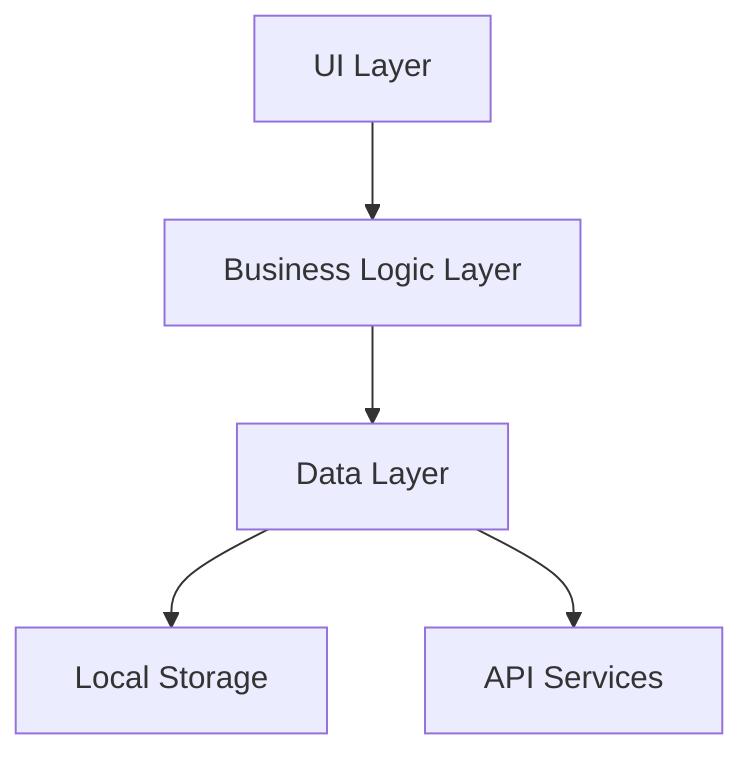

# AFK Life

<div align="center">


A gamified life-tracking application that turns daily activities into RPG-style statistics.

[Live Demo](#) · [Installation](#installation) · [Features](#features) · [Technical Details](#technical-details)

</div>

## 🎮 Project Overview

AFK Life transforms everyday activities into a game-like experience, helping users track and visualize their daily progress through:
- Personal stat tracking (Exercise, Learning, Social, etc.)
- Achievement system
- Progress visualization
- Daily/Weekly quests

### 📱 Screenshots & Demo

<div align="center">
[Insert 2-3 key screenshots showing main features]

[Include a GIF demonstrating core functionality]
</div>

## 🚀 Features

### Core Features
- **Stat Tracking System**
  - Real-time stat updates
  - Historical data visualization
  - Custom category creation
  
- **Achievement System**
  - Milestone tracking
  - Custom achievement creation
  - Progress notifications

- **Data Visualization**
  - Daily/Weekly/Monthly trends
  - Category comparisons
  - Progress charts

### Technical Features
- **Flutter Implementation**
  - Custom widgets for stat displays
  - Animated progress indicators
  - Responsive design for various screen sizes

- **State Management**
  - [Provider/Bloc] for state management
  - Efficient data flow architecture
  - Real-time updates

- **Data Persistence**
  - Local storage using SQLite
  - Data backup functionality
  - Cross-device synchronization

## 🛠️ Installation

```bash
# Clone the repository
git clone https://github.com/yourusername/afk-life.git

# Navigate to project directory
cd afk-life

# Install dependencies
flutter pub get

# Run the application
flutter run
```

## 🏗️ Technical Architecture



### Key Components
- **UI Layer**: Flutter widgets and screens
- **Business Logic**: State management and core logic
- **Data Layer**: Repository pattern implementation
- **Storage**: SQLite integration

## 🧪 Testing

```bash
# Run all tests
flutter test

# Run specific test file
flutter test test/widget_test.dart
```

## 📚 Development Journey

### Challenges & Solutions
1. **Challenge**: Implementing real-time stat updates
   - Solution: Custom state management using [technique]
   
2. **Challenge**: Efficient data storage
   - Solution: Optimized SQLite schema design

### Future Improvements
- [ ] Cloud synchronization
- [ ] Social features
- [ ] Advanced analytics
- [ ] Customizable themes

## 🤝 Contributing

Contributions are welcome! Please read our [Contributing Guide](CONTRIBUTING.md) for details on our code of conduct and the process for submitting pull requests.

## 📝 Development Log

### Latest Updates
- [Date] Added achievement system
- [Date] Implemented data visualization
- [Date] Enhanced UI/UX design

## ⚖️ License

This project is licensed under the MIT License - see the [LICENSE](LICENSE) file for details.

## 🙋‍♂️ About the Developer

Built with 💜 by RICHARD LE
- Portfolio: [link]
- LinkedIn: [link]
- Twitter: [link]